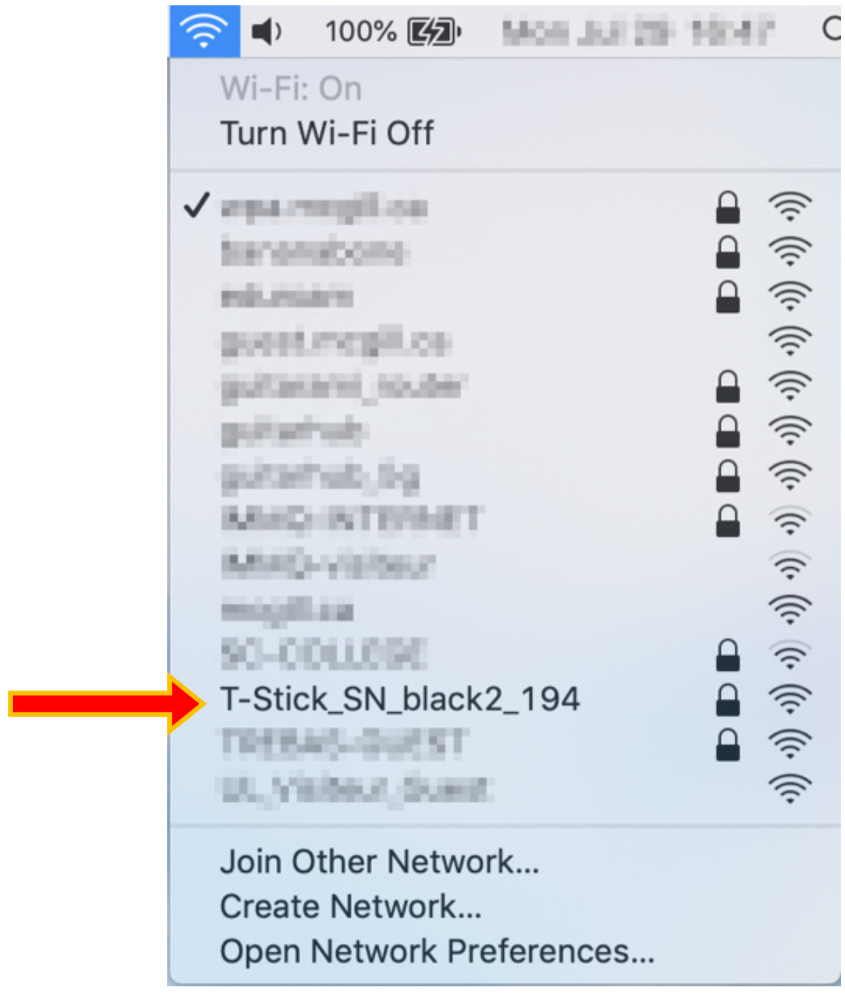
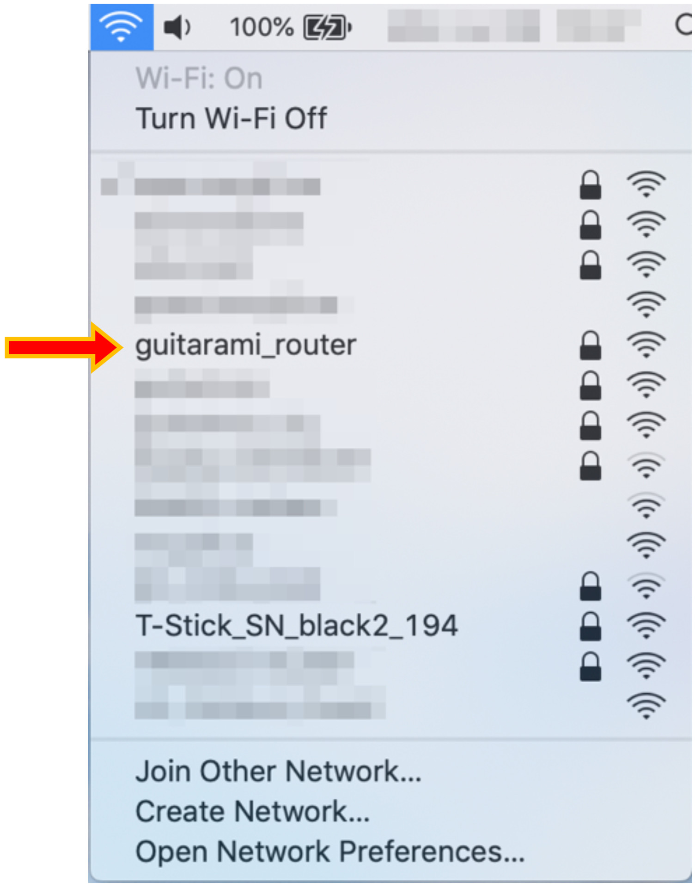

 &emsp; &emsp; &emsp; &emsp; 

# T-Stick Connecting Guide (v1.2)

This guide will show how to connect the T-Stick to a computer running macOS. This guide was tested on macOS Mojave, but it should work on older versions. To connect on Windows or Linux machines the procedure is similar, and this guide can serve as well.

Once this process is done, the T-Stick should connect to the computer automatically as long as both the computer and the T-Stick maintain the same IP address and use the same network.

The process, after learned, should take no more than 3min.

## 1-) Enter T-Stick setup, and connect to a network:

- Turn the T-Stick on:

.jpg "Turn the T-Stick on")

- Push the setup button for at least 3 seconds (long press) to enter AP-mode. The T-Stick will then create an access point.

.jpg "Enter AP mode")

-  Connect to the T-Stick network (default password: `mappings`):

- The setup portal should open automatically as soon as the computer connects to the T-Stick network. In case the setup portal does not open, locate the T-Stick's IP address (e.g. run `arp -a` at the command line on linux), and navigate to that address with your web browser.
- The page will inform the saved SSID and connection status. Click on Configuration.

.jpg "Access portal")

- Choose the Wi-Fi network that will be used to connect the T-Stick and the computer. In this guide, we will use the _guitarami\_router_ network. Don’t forget to type the password (be
careful, the password is never hidden).

.jpg "Choose wifi network")

- Go to the end of the page and save your settings.

.jpg "Save settings")

- Wait at least 5 seconds before click in __how it went__. This will take you to the main setup page.
- If your configuration page differs from that shown, you may need to return to the config page, scroll to the bottom, and reboot your T-Stick, at which point it should connect to the configured network (_guitarami/_router_ in our example).

.jpg "How it went")

- Check if the T-Stick is connected and if an IP was attributed to the instrument. Take note of the T-Stick IP address. Leave the portal open (do not hit __exit portal__).

.jpg "Check if connected")

## 2-) Connect your computer/device to the same network, and access the T-Stick setup though the browser:

- Connect your computer to the same network the T-Stick currently is. In your case, we will connect to _guitarami\_router_.

- Open your web browser and type the T-Stick IP address to access the setup portal using the chosen network.

.jpg "Portal browser (1)")

You will see the main portal screen through the web browser. Enter “Configuration” one more time.

.jpg "Portal browser (2)")

## 3-) Configure IP address/port to send OSC messages:

- Check the computer’s current IP (in macOS, you can hold the _Option_ key and hit the Wi-Fi icon to check that information). Copy the computer’s IP into the field “IP to send OSC messages”. Hit “Save”.

.jpg "Check computer's IP")

- Wait 5 more seconds and hit __how it went__:

.jpg "How it went again")

- Check if the T-Stick is connected and hit __Exit Portal__. The T-Stick will start send information after the portal closes.

.jpg "Exit portal")

- You can now close your browser and play the T-Stick.

.jpg "Close browser")

## Guide info:

Version 1.2: (2020/03/20) Edu Meneses - eduardo.meneses@mail.mcgill.ca
Version 1.11: (2019/11/27) Edu Meneses
Version 1.1: (2019/10/27) Edu Meneses
Version 1.0: (2019/08/28) Edu Meneses

__Input Devices and Music Interaction Laboratory__\
[http://www.idmil.org](http://www.idmil.org)\
Schulich School of Music\
McGill University\
550 Rue Sherbrooke Ouest, Suite 500\
Montreal, QC, H3A 1E\
Canada
