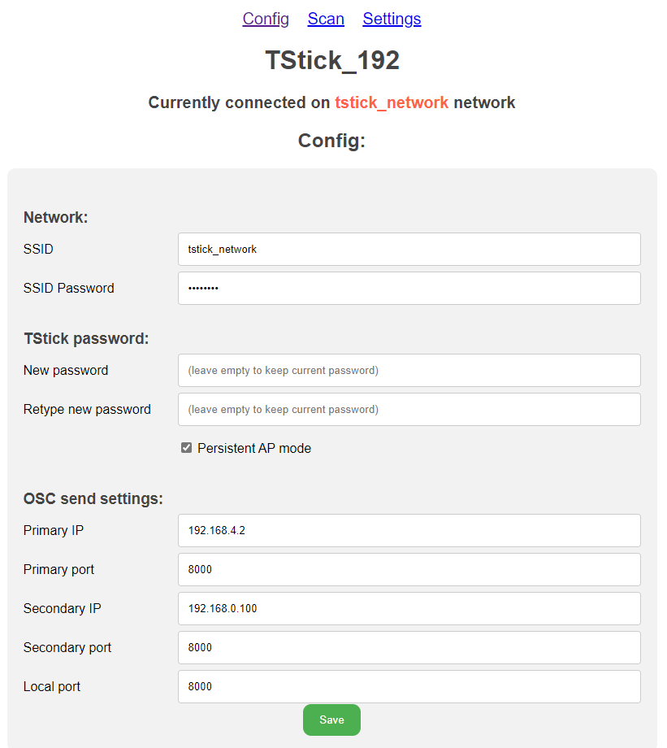

 &emsp; &emsp; &emsp; &emsp; 

# T-Stick Connecting Guide (v1.3)

## Option 1: Wireless Connection
### Get your network details
1. Connect to the network you will be connecting the T-Stick to.
2. Note the SSID (network name) and SSID Password (network password).
3. Get your computers IP address while connected to this network. Below are linked some support articles for Windows, MacOS and Linux on how to find your computers IP address.
    - [Find your IP Address Windows](https://support.microsoft.com/en-us/windows/find-your-ip-address-in-windows-f21a9bbc-c582-55cd-35e0-73431160a1b9)
    - [Find your IP Address MacOS](https://discussions.apple.com/thread/253927735)
    - [Find your IP Address Linux](https://opensource.com/article/18/5/how-find-ip-address-linux)

### Connect to the T-Stick Module.
4. Power on your T-Stick and wait until the boot sequence is complete. If your T-Stick does not have a Power switch press the button once and wait for the T-Stick to turn on.
5. Connect to the T-Stick_XXX wifi network where XXX is the ID of the T-Stick. ie: TStick_001. By default the password is mappings.
6. Open your browser and go to [http://TStick_XXX.local/](http://TStick_XXX.local/) or [http://192.168.4.1](http://192.168.4.1), where XXX is the ID of the T-Stick module.

7. In the __Network__ section write the network name and password optained in Step 2 in the __SSID__ and __SSID Password__ fields. 
8. In the __OSC send settings__ put in your computer's IP address optained in Step 3 in the __Primary IP__ field.
8. Click the green __Save__ button. You will be directed to a page saying that the information was saved successfully.
6. Click __Config__ on the top of the page to return to the orginal menu.
7. Click the green __Close and Reboot__ button at the bottom of the page.

## Option 2: Puara Serial Manager
1. Download or clone the Puara client repository at https://github.com/Puara/puara-client. Instructions for how to clone github repositories can be found at the link below
    - [Cloning a Git Repository](https://docs.github.com/en/repositories/creating-and-managing-repositories/cloning-a-repository).
2. Open `config_template.json`.
3. Put in the network name you want the T-Stick to connect to in the __wifiSSID__ field.
4. Put the network password in the __wifiPSK__ field.
5. Save and close `config_template.json`.
6. Run the `puara_serial_manager.py` script.
7. Connect the T-Stick to your PC using a USB cable.
8. The script should auto detect and configure the T-Stick. If the T-Stick is not being detected you may need to download the CP210x USB driver. A link can be found on [Esspressif's website](https://docs.espressif.com/projects/esp-idf/en/latest/esp32/get-started/establish-serial-connection.html).

## Guide info:

Version 1.3: (2022/11/19) Albert-Ngabo Niyonsenga - albert-ngabo.niyonsenga@mail.mcgill.ca
Version 1.2: (2020/03/20) Edu Meneses - eduardo.meneses@mail.mcgill.ca
Version 1.11: (2019/11/27) Edu Meneses
Version 1.1: (2019/10/27) Edu Meneses
Version 1.0: (2019/08/28) Edu Meneses

__Input Devices and Music Interaction Laboratory__\
[http://www.idmil.org](http://www.idmil.org)\
Schulich School of Music\
McGill University\
550 Rue Sherbrooke Ouest, Suite 500\
Montreal, QC, H3A 1E\
Canada
