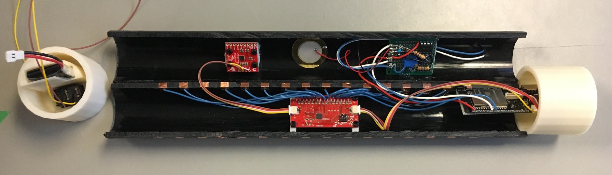
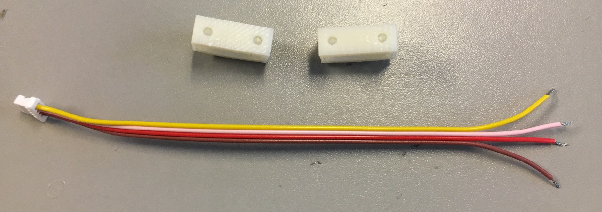
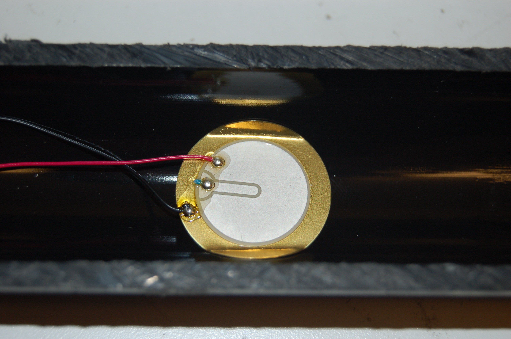
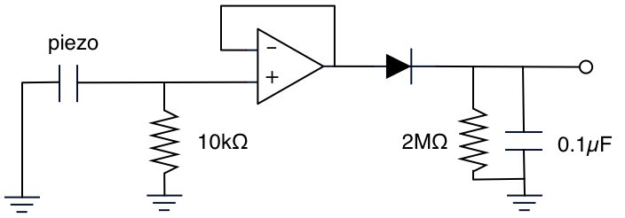

# Building a Sopranino T-Stick (v1.1)




## Bill of Materials:

Qty   | Type                | Description 
------|---------------------|-----------------------------------------------------------------------------------
01    | sensor              | [Capsense](https://www.cypress.com/le/127221/download) breakout board (CY8CMBR3116)
01    | sensor              | [IMU breakout board LSM9DS](https://www.sparkfun.com/products/13284)
01    | sensor              | [FSR 408](https://www.robotshop.com/ca/en/interlink-24-long-fsr.html)
01    | sensor              | [buzz elem. piezo STD](https://www.digikey.ca/product-detail/en/cui-inc/CEB-20D64/102-1126-ND/412385)
01    | electronics         | [microcontroller Lolin D32 Pro](https://wiki.wemos.cc/products:d32:d32_pro)
01    | electronics         | [0.1uF capacitor](https://www.digikey.ca/product-detail/en/kemet/C320C104J5R5TA7301/399-9867-1-ND/3726105)
01    | electronics         | 1K resistor
01    | electronics         | [10K resistor](https://www.digikey.ca/product-detail/en/CFM12JT10K0/S10KHCT-ND/2617547/?itemSeq=307630589)
01    | electronics         | [2M resistor](https://www.digikey.ca/product-detail/en/CFM12JT2M00/S2MHCT-ND/2617413/?itemSeq=307631009)
01    | electronics         | [Diode 1N4004](https://www.digikey.ca/product-detail/en/1N4004-TP/1N4004-TPMSCT-ND/773691/?itemSeq=307634719)
01    | electronics         | [10K potentiometer](https://www.digikey.com/products/en?mpart=PV36W103C01B00&v=118)
01    | electronics         | [LM358P Opamp](https://www.digikey.ca/products/en?keywords=296-1395-5-ND)
01    | electronics         | [button](https://www.digikey.ca/product-detail/en/c-k/PTS125SM43-2-LFS/CKN9100-ND/1146743)
02    | electronics         | [SH1.0 cables](https://www.aliexpress.com/item/32877217306.html)
02    | electronics         | [Breadboards](https://www.digikey.ca/product-detail/en/sparkfun-electronics/PRT-08808/1568-1652-ND/7387401)
30cm  | manufacturing parts | PVC Tube split in 2 lenghtwise
~85cm | manufacturing parts | Copper adhesive tape
01    | manufacturing parts | Li-Po Battery (min 1000mA)
01    | manufacturing parts | [ON-OFF rocker switch](https://www.digikey.ca/product-detail/en/RA1113112R/EG5619-ND/3778055/?itemSeq=307636370)
~35cm | manufacturing parts | Heat shrink tube
01    | manufacturing parts | end-cup with microcontroller base
01    | manufacturing parts | end-cup with for the ON-OFF switch and hold battery
02    | manufacturing parts | 3D printed bases for Capsense
02    | manufacturing parts | [3D printed bases for IMU](/images/SopraninoIMUparts.jpg)
11    | manufacturing parts | [M2 Mounting Screws](https://www.digikey.ca/product-detail/en/MPMS+002+0008+PH/H739-ND/274950/?itemSeq=307635387)
11    | manufacturing parts | [M2 bolts](https://www.digikey.ca/product-detail/en/MHNZ+002+4/H761-ND/274972/?itemSeq=307635458)
01    | manufacturing parts | [foam sheet](https://www.amazon.ca/Craft-Foam-Sheets-Assorted-Colours/dp/B005EQPRM6)


## Schematic:


This schematic is outdated. Use for FSR and Piezo Electronics reference only.

## Instructions:

#### Building the Frame:

Cut the PVC in half as in the picture and tape the conductive tape 1.5cm apart. 
Length of holes assembly is 1.5 * 15 for 16 strips. That is 22.5cm. You need aprox. 8 cm of copper tape per strip.

The Capsense (https://www.cypress.com/le/127221/download) breakout boards use 2 3D printed bases. It connects via a jumper cable with SH1.
connectors to the D32 Pro (https://wiki.wemos.cc/products:d32:d32_pro).

__CAUTION__: THE CAPSENSE BOARD HAS THE CONNECTORS LABELED FOR THE IMU AND MICROCONTROLLER (Black marker). BE CAREFUL WHEN CONNECTING THEM BECAUSE OF A LAST MINUTE CHANGE IN THE PINOUT OF THE BOARD. SEE SCHEMATIC BELOW. 

The Capsense label for ground and +3V3 is inverted at the end that goes to the IMU. You should connect:

__Capsense -> IMU__
GND ------> +3V3
SDA ------> SDA
SCL ------> SCL
+3V3------> GND


Please take extra care since it is necessary to cut the cable and solder the right ends at the IMU.


All the building tools can be found in the Machine Shop at the McGill Music Tech Department.


#### IMU:

The [LSM9DS1](https://www.sparkfun.com/products/13284) IMU connects via another SH1.0 cable to the other socket on the Capsense for I2C communication. One end has the SH housing the other is open to solder onto the IMU breakout board. There are also 2 3D printed bases to attach the IMU to the frame.



The T-Stick Spatial orientation is dened as follows:


Please, install the IMU so that this conguration is kept consistent will the design.


#### FSR and Piezo Electronics:

The Force Sensitive Resistor and the Piezoelectric sensor are glued to the frame with epoxy, superglue, or hot glue. 



The signal processing circuit is all analog and needs to be soldered to a perfboard. The piezoelectric circuit output is to be soldered to pin 32 of the ESP32 and the FSR circuit output to pin 33. Electronic building tools can be found in the Electronics Shop at the McGill Music Tech Department.

__Recommendation: Solder long cables to the FSR pins. They are very delicate. Put some heat shrink tube to reinforce the end of the fsr so it doesn’t break. If it breaks, it’s not repairable.__

Here’s the pinout for the LM358 opamp you will be using in the above circuit:

```
                      +--()--+
             Output A | 1   8| V+
    Inverting Input A | 2   7| Output B
Non-Inverting Input A | 3   6| Inverting Input B
                  GND | 4   5| Non-Inverting Input B
                      +------+
```

OBS: Don't forget to connect GND and V+.

##### Envelope Follower Circuit



##### Voltage Divider Circuit


#### Microcontroller:

The microcontroller to be used with the T-Stick is the Lolin D32 PRO. You can check the tech specs at https://wiki.wemos.cc/products:d32:d32_pro.

#### Firmware:

Instructions to upload (flash) the T-Stick firmware and configuration files can be found [here](../README.md).

Read and follow __ALL__ the instructions at before upload it to the board. There are some steps to prepare your machine and the ESP32 before flash it for the first time.

It is recommended to use the board test firmwares located at https://github.com/IDMIL/TStick/tree/master/Sopranino/2GW/19X/Tests to test the capsense board and the IMU after install them.

Nightly builds and beta firmwares can be downloaded at https://github.com/edumeneses/TStick. Before using them, contact the IDMIL's lab team.


## More info:

Version 1.1: Edu Meneses - eduardo.meneses@mail.mcgill.ca\
Version 1.0: Created by: Alex Nieva - alex.nieva@mail.mcgill.ca

__Input Devices and Music Interaction Laboratory__
http://www.idmil.org\
Schulich School of Music\
McGill University\
550 Rue Sherbrooke Ouest, Suite 500\
Montreal, QC, H3A 1E\
Canada

